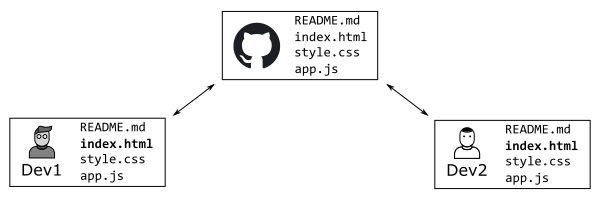
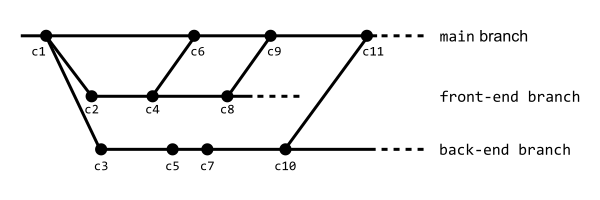
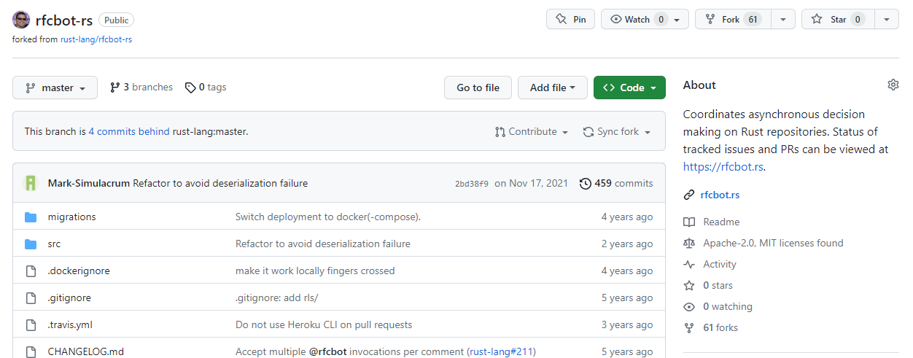

# PJP PEC 1

En esta PEC vamos a aprender a manejar GitHub y el entorno de programación que utilizaremos en el resto de PECs de la asignatura.

## Competencias

En esta PEC se desarrollan las siguientes competencias del Máster:

- Utilizar de manera adecuada el lenguaje JavaScript y usarlo en el desarrollo de sitios y aplicaciones web, en función de las necesidades del proyecto.
- Adaptarse a las tecnologías web y a los futuros entornos, actualizando las competencias profesionales.
- Aprender y actualizarse permanentemente.

## Objetivos

Los objetivos de esta PEC son:

- Configurar un entorno de trabajo para el desarrollo de aplicaciones en JavaScript.
- Conocer y saber utilizar los comandos básicos de Git.
- Conocer y saber utilizar GitHub y las principales tareas colaborativas de la plataforma.
- Revisar el nivel previo de programación.
- Poner en práctica conocimientos básicos de JavaScript.

## Entrega de la PEC

Una vez hayas realizado las actividades prácticas propuestas en este enunciado, **la entrega se realizará de forma doble**:

- Deberás enviar tus cambios al apartado del aula virtual de la UOC.
- Deberás enviar tus cambios al repositorio de GitHub Classroom.

Recuerda que este repositorio lo has clonado del repositorio en GitHub. Cuando trabajes en tu sistema, todos los cambios los harás en tus ficheros locales, los cuales tendrás que añadir y _comitear_ a tu repositorio Git. Estos cambios estarán en tu sistema hasta que hagas _push_ y los envíes al repositorio en GitHub.

Recuerda que debes trabajar en la rama _main_ o _master_ (la que se cree por defecto). Puedes hacer varios envíos.

En el aula virtual encontrarás una _checklist_ que te ayudará a repasar todos los pasos que debes hacer para la entrega de tu PEC.

## Puntuación

El hecho de trabajar con tests para verificar la funcionalidad del código os permitirá tener una idea de vuestra propia nota antes de la entrega.

La puntuación de los ejercicios prácticos se basa en dos criterios: **Funcionalidad** e **implementación**. Se espera que los ejercicios funcionen correctamente (pasen los tests) y que la implementación (el código) tenga una calidad adecuada.

Algunos detalles a tener en cuenta:

- Se penalizará cualquier intento de _hardcodear_ los tests para forzar que pasen. Esta técnica consiste en cambiar la implementación para que devuelva únicamente el valor esperado por el test (cualquier otro test fallaría).
- Los tests automáticos están diseñados para detectar ejercicios erróneos o incompletos para casos concretos. El hecho de que un test pase no garantiza que el ejercicio esté realizado correctamente, es decir, que cubra todos los casos.
- Un ejercicio cuyos tests no pasan se puntuará con un 0 salvo que existan problemas con el test.
- Además de pasar los tests, el profesorado evaluará vuestro código en base a los siguientes criterios:
  - Legibilidad, sencillez y calidad del código.
  - Conocimientos de programación. Por ejemplo, no utilizar las estructuras de control adecuadas, cómo utilizar un bucle para construir una sentencia condicional o viceversa.

## Requisitos mínimos

- Tener instalado Visual Studio Code.
- Conocimientos básicos de Git y GitHub (Actividades 2 y 3 del Reto 1).
- Conocimientos básicos de programación (Requisito de la asignatura).

## Actividades del reto (1p)

Recuerda que este reto tiene asociadas dos actividades de evaluación que también deberás realizar. En particular, son las actividades 2.4 y 3.2, que encontrarás en el aula virtual.

## Preguntas Teóricas (7p)

Deberás responder a estas preguntas en el fichero [src/README.md](src/README.md)

### Ejercicio T1 (3p)

La siguiente imagen muestra un escenario de desarrollo colaborativo en GitHub:



En la parte superior central puedes ver el repositorio en GitHub, el cual contiene los ficheros indicados en la caja. En la parte inferior, se han representado dos desarrolladores (uno en la parte izquierda y otro en la derecha, denominados `Dev1` y `Dev2`, respectivamente), cada uno de los cuales ha clonado el repositorio de GitHub. Además, cada desarrollador ha editado el fichero indicado en negrita.

Responde y razona las siguientes preguntas (máximo 300 palabras):

- T1.1 (2p) Indica los comandos que debería realizar cada desarrollador para sincronizar sus cambios con el repositorio en GitHub. No tengas en cuenta la posibilidad de que se produzca un conflicto, ya que ese caso se trata en el siguiente apartado.
- T1.2 (1p) ¿Puede darse alguna situación de conflicto en este escenario?

### Ejercicio T2 (3p)

La siguiente figura muestra un escenario de la evolución de un repositorio donde trabaja un equipo de desarrollo que está creando una aplicación web:



Cada una de las líneas horizontales representa una rama en el repositorio. Como puede observarse, existen tres ramas:

- `main`, que es la rama principal del repositorio.
- `front-end`, donde trabaja el equipo de desarrollo que está creando el _front-end_ de la aplicación.
- `back-end`, donde trabaja el equipo de desarrollo que está creando el _back-end_ de la aplicación.

Además, cada círculo representa un commit en el repositorio. Los commits se han numerado según su momento temporal de creación. Además, su posición horizontal en cada una de las ramas también ayuda a visualizar el momento temporal en el que se han creado. De esta manera, el commit `c6` se ha creado antes que el commit `c8`, y el círculo que representa `c6` está más a la izquierda que el círculo que representa `c8`.

Responde y razona la siguiente pregunta (máximo 300 palabras):

- T2.1 (1p) ¿Qué commits están considerados en la rama `front-end`?
- T2.2 (2p) El escenario incluye un conflicto, ¿cuál es? ¿cómo lo solucionarías?

### Ejercicio T3 (1p)

El usuario `jlcanovas` de GitHub te muestra uno de los repositorios de su cuenta GitHub. La siguiente captura muestra parte de la pantalla que te muestra.



El usuario afirma que todo el trabajo de ese repositorio es suyo, y que siempre ha trabajado, desde su inicio, solo en el desarrollo del código.

Responde y razona las siguientes preguntas (máximo 300 palabras):

- (1p) ¿Tienes motivos para dudar de la afirmación del desarrollador? ¿Por qué?

## Ejercicios prácticos (2p)

Para realizar los ejercicios prácticos debes dirigirte al fichero [src/App.js](src/App.js)

En este fichero deberás definir las funciones que te indicamos en los ejercicios que verás más abajo.

Por otro lado, los tests que te permitirán saber si la solución que propones para los ejercicios es correcta están en el fichero [src/App.test.js](src/App.test.js).
**No debes editar este fichero**.
Ten en cuenta que los tests son condiciones que deben cumplir las funciones que implementarás en los ejercicios, por lo que pueden servirte de ayuda para corregirlos.

### Preparando el entorno. (0p)

En primer lugar, asegúrate de que tienes instalados:

- [Node.js](https://nodejs.org/es/)
- [VSCode](https://code.visualstudio.com/)
- [Git](https://git-scm.com/)

Para que vuestro profesor os localice en GitHub Classroom, recuerda que necesita conocer vuestro _login_ en la plataforma. Una vez estéis registrados en GitHub, podéis informar de vuestro _login_ tal y cómo se describe en la actividad 4.2 del Reto 1.

A continuación te damos algunas indicaciones para preparar tu repositorio para la realización de los ejercicios.

#### Instala las dependencias del proyecto

```
npm install
```

Recuerda que es necesario estar situado en la carpeta raíz del proyecto.

#### Ejecuta los tests

```
npm t
```

La instrucción anterior lanzará los tests cada vez que guardes el fichero [src/App.js](src/App.js), que es precisamente donde implementarás los ejercicios de esta PEC.

Como puedes esperar, la primera vez que ejecutes `npm t` y se lancen los tests, fallarán todos, ya que no hay ningún ejercicio implementado. Revisa el mensaje de error que se imprime para conocer su formato y entender cómo se notifican los errores.

Este es un ejemplo de una posible salida de error:

```
 FAIL  src/App.js
  ex1:
    × should return true when temp is bigger or equal than 37.0 (2 ms)
```

Es importante fijarse en la descripción del error, por ejemplo, el texto de error anterior indica que para el ejercicio 1 (`ex1`) la función debe devolver `true` si `temp` es mayor o igual que 37.0. Esta indicación os ayuda a revisar el código para comprobar porqué el comportamiento no es el esperado.

Una vez corregido el problema, en cuanto se guarda el fichero donde estamos editando los ejercicios, el test se vuelve a lanzar y nos mostraría:

```
 PASS  src/App.js
  ex1
    √ should return true when temp is bigger or equal than 37.0 (2 ms)
```

Ahora el test muestra `PASS` y el caso de prueba que antes fallaba se muestra cómo correcto (con el carácter `√`).

El entorno de pruebas tiene un menú (accesible mediante la tecla `w`) que os permite ejecutar los tests selectivamente. Por ejemplo, pulsando `a` podéis relanzar manualmente todos los tests; y pulsando `f` podéis relanzar solamente aquellos tests que han fallado. Probad las diferentes opciones y si tenéis alguna duda, consultadla en el foro de la asignatura.

### Ejercicio P1 (1p)

Implementa una función `ex1` que determine si un determinado valor numérico es negativo.

La función recibirá el siguiente parámetro:

- `value`: Es un valor numérico.

La función devolverá `true` si el valor es negativo y `false` en otro caso.

### Ejercicio P2 (1p)

Implementa una función `ex2` que calcule el precio de una línea de pedido en un ticket de compra.

La función recibirá los siguiente parámetros:

- `price`: El precio de venta de una unidad de producto. Es un valor numérico positivo que puede llevar decimales.
- `amount`: Es la cantidad de unidades de producto de la línea de pedido. Es un valor numérico positivo.

La función deberá devolver el precio total de la línea de pedido, es decir, el valor total de la venta de todas las unidades de producto de la línea de pedido.
