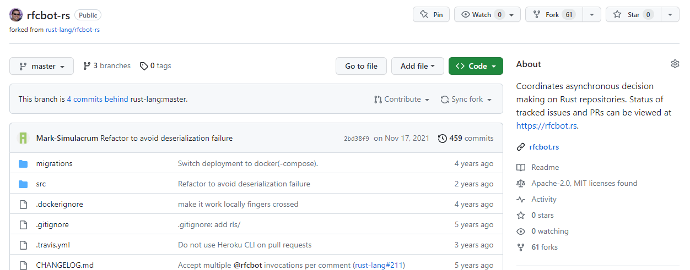

# PJP PAC 1

En aquesta PAC aprendrem a gestionar GitHub i el seu entorn de programació estàndard que utilitzarem a la resta de PACs de l'assignatura.

## Competències

En aquesta PAC es desenvolupen les següents competències del Màster:

- Utilitzar de manera adequada el llenguatge JavaScript i fer-lo servir en el desenvolupament de llocs i aplicacions web, en funció de les necessitats del projecte.
- Adaptar-se a les tecnologies web i als entorns futurs, actualitzant les competències professionals.
- Aprendre i actualitzar-se permanentment.

## Objectius

Els objectius d'aquesta PAC són:

- Configurar un entorn de treball per desenvolupar aplicacions en JavaScript.
- Conèixer i saber utilitzar les ordres bàsiques de Git.
- Conèixer i saber utilitzar GitHub i les principals tasques col·laboratives de la plataforma.
- Revisar el nivell previ de programació.
- Posar en pràctica coneixements bàsics de JavaScript.

## Entrega de la PAC

Un cop hagis realitzat les activitats pràctiques proposades en aquest enunciat, **el lliurament es realitzarà de forma doble**:

- Hauràs d'enviar els teus canvis a l'apartat de l'aula virtual de la UOC.
- Hauràs d'enviar els teus canvis al Repositori de GitHub Classroom.

Recorda que aquest repositori l'has clonat del repositori a GitHub. Quan treballis al teu sistema, tots els canvis els faràs als teus fitxers locals, els quals hauràs d'afegir i _comitejar_ al teu repositori Git. Aquests canvis estaran al teu sistema fins que facis _push_ i els enviïs al repositori a GitHub. 

Recorda que has de treballar a la branca _main_ o _master_ (la que es crei per defecte). Pots fer diversos enviaments.

A l'aula virtual trobaràs una _checklist_ que t'ajudarà a repassar tots els passos que has de fer per al lliurament de la teva PAC.

## Puntuació

El fet de treballar amb tests per verificar la funcionalitat del codi, us permetrà tenir una idea de la vostra pròpia nota abans del lliurament. 

La puntuació dels exercicis pràctics es basa en dos criteris: **Funcionalitat** i **implementació**. S'espera que els exercicis funcionin correctament (passin els tests) i que la implementació (el codi) tingui una qualitat adequada. 

Alguns detalls a tenir en compte:

- Es penalitzarà qualsevol intent de _hardcodejar_ els tests per forçar que passin. Aquesta tècnica consisteix a canviar la implementació perquè torni únicament el valor esperat pel test (qualsevol altre test fallaria).
- Els tests automàtics estan dissenyats per detectar exercicis erronis o incomplets. El fet que un test passi no garanteix que l'exercici estigui realitzat correctament.
- Un exercici els tests del qual no passen es puntuarà amb un 0 llevat que hi hagi problemes amb el test.
- A més de passar els tests, el professorat avaluarà el vostre codi en base als criteris següents:
  - Llegibilitat, senzillesa i qualitat del codi.
  - Coneixements de programació. Per exemple, no utilitzar les estructures de control adequades, com ara utilitzar un bucle per construir una sentència condicional o viceversa.

## Requeriments mínims

- Tenir instal·lat Visual Studio Code.
- Coneixements bàsics de Git i GitHub (Activitats 2 i 3 del Repte 1).
- Coneixements bàsics de programació (Requisit de l'assignatura).

## Activitats del repte (1p)

Recorda que aquest repte té associades dues activitats d'avaluació que també hauràs de realitzar. En particular, són les activitats 2.4 i 3.2, que trobaràs a l'aula virtual.

## Preguntes Teòriques (7p)

Hauràs de respondre aquestes preguntes al fitxer `src/pec1/pec1.md`

### Exercici T1 (3p)

La següent imatge mostra un escenari de desenvolupament col·laboratiu en GitHub:


A la part superior central pots veure el repositori en GitHub, el qual conté els fitxers indicats a la caixa. A la part inferior, s'han representat dos desenvolupadors (un a l'esquerra i un altre a la dreta, denominats `Dev1` i `Dev2`, respectivament), cadascun dels quals ha clonat el repositori de GitHub. A més, cada desenvolupador ha editat el fitxer indicat en negreta. 

Respon i raona les següents preguntes (màxim 300 paraules):
* T1.1 (2p) Indica les comandes que hauria de realitzar cada desenvolupador per a sincronitzar els seus canvis amb el repositori en GitHub. No tinguis en compte la possibilitat que es produeixi un conflicte, ja que aquest cas es tracta en el següent apartat.
* T1.2 (1p) Pot donar-se alguna situació de conflicte en aquest escenari?

### Exercici T2 (3p)

La següent figura mostra un escenari de l'evolució d'un repositori on treballa un equip de desenvolupament que està creant una aplicació web:


Cadascuna de les línies horitzontals representa una branca en el repositori. Com pots veure, existeixen tres branques:

* `main`, que és la branca principal del repositori.
* `front-end`, on treballa l'equip de desenvolupament que està creant el _front-end_ de l'aplicació.
* `back-end`, on treballa l'equip de desenvolupament que està creant el _back-end_ de l'aplicació. 

A més, cada cercle representa un commit en el repositori. Els commits s'han numerat segons el seu moment temporal de creació. A més, la seva posició horitzontal en cadascuna de les branques també ajuda a visualitzar el moment temporal en el qual s'han creat. D'aquesta manera, el commit `c6` s'ha creat abans que el commit `c8`, i el cercle que representa `c6` està més a l'esquerra que el cercle que representa `c8`. 

Respon i raona la següent pregunta (màxim 300 paraules):
* T2.1 (1p) Quins commits són considerats a la branca `front-end`? 
* T2.2 (2p) L'escenari inclou un conflicte, quin és? com el solucionaries?

### Exercici T3 (1p)

L'usuari `jlcanovas` de GitHub et mostra un dels repositoris del seu compte GitHub. La següent captura mostra part de la pantalla que et mostra.



L'usuari afirma que tot el treball d'aquest repositori és seu, i que sempre ha treballat, des del seu inici, només en el desenvolupament del codi.  

Respon i raona les següents preguntes (màxim 300 paraules):
* (1p) Tens motius per a dubtar de l'afirmació del desenvolupador? Per què?

## Exercicis pràctics (2p)

Per realitzar els exercicis pràctics t'has de dirigir al fitxer `src/pec1/pec1.js`.

En aquest fitxer hauràs de definir les funcions que t'indiquem als exercicis que veuràs més avall.

D'altra banda, els tests que et permetran saber si la solució que proposes per als exercicis és correcta són al fitxer `src/pec/pec1.spec.js`.
**No has d'editar aquest fitxer**.
Tingues en compte que els tests són condicions que han de complir les funcions que implementaràs en els exercicis, per la qual cosa et poden servir d'ajuda per corregir-los.

### Preparant l'entorn. (0p)

En primer lloc, assegura't que tens instal·lats:

- [Node.js](https://nodejs.org/es/)
- [VSCode](https://code.visualstudio.com/)
- [Git](https://git-scm.com/)

Perquè el vostre professor us localitzi a GitHub Classroom, recorda que necessita conèixer el vostre _login_ a la plataforma. Un cop estigueu registrats a GitHub, podeu informar del vostre _login_ tal com es descriu a l'activitat 4.2 del Repte 1.

A continuació us donem algunes indicacions per preparar el vostre repositori per a la realització dels exercicis.

#### Instal·la les dependències del projecte

````
npm install
````

Recorda que cal estar situat a la carpeta arrel del projecte.

#### Executa els tests

````
npm t
````

La instrucció anterior llançarà els tests cada vegada que deseu el fitxer `src/pec1/pec1.js`, que és precisament on implementareu els exercicis d'aquesta PAC.

Com pots esperar, la primera vegada que executis `npm t` i es llencin els tests, fallaran tots, ja que no hi ha cap exercici implementat. Revisa el missatge d'error que s'imprimeix per conèixer el format i entendre com es notifiquen els errors.

Aquest és un exemple d'una possible sortida d'error:

````
  FAIL src/pec1/pec1.spec.js
   ex1:
     × should return true when temp is bigger or equal than 37.0 (2 ms)
````

És important fixar-se en la descripció de l'error, per exemple, el text d'error anterior indica que per a l'exercici 1 (`ex1`) la funció ha de tornar `true` si `temp` és més gran o igual que 37.0. Aquesta indicació us ajuda a revisar el codi per comprovar perquè el comportament no és l'esperat.

Un cop corregit el problema, quan es desa el fitxer on estem editant els exercicis, el test es torna a llançar i ens mostraria:

````
  PASS src/pec1/pec1.spec.js
   ex1
     √ should return true when temp is bigger or equal than 37.0 (2 ms)
````

Ara el test mostra `PASS` i el cas de prova que abans fallava es mostra com a correcte (amb el caràcter `√`).

L'entorn de proves té un menú (accessible mitjançant la tecla `w`) que us permet executar els tests selectivament. Per exemple, prement `a` podeu rellançar manualment tots els tests; i prement `f` podeu rellançar només aquells tests que han fallat. Proveu les diferents opcions i si teniu algun dubte, consulteu-lo al fòrum de l'assignatura.

### Exercici P1 (1p)

Implementa una funció `ex1` que determini si un determinat valor numèric és negatiu.

La funció rebrà el següent paràmetre:
* `value`: És un valor numèric.

La funció retornarà `true` si el valor és negatiu i `false` en un altre cas.

### Exercici P2 (1p)

Implementa una funció `ex2` que calculi el preu d'una línia de comanda en un tiquet de compra.

La funció rebrà els següent paràmetres:
* `price`: El preu de venda d'una unitat de producte. És un valor numèric positiu que pot portar decimals.
* `amount`: És la quantitat d'unitats de producte de la línia de comanda. És un valor numèric positiu.

La funció haurà de retornar el preu total de la línia de comanda, és a dir, el valor total de la venda de totes les unitats de producte de la línia de comanda.